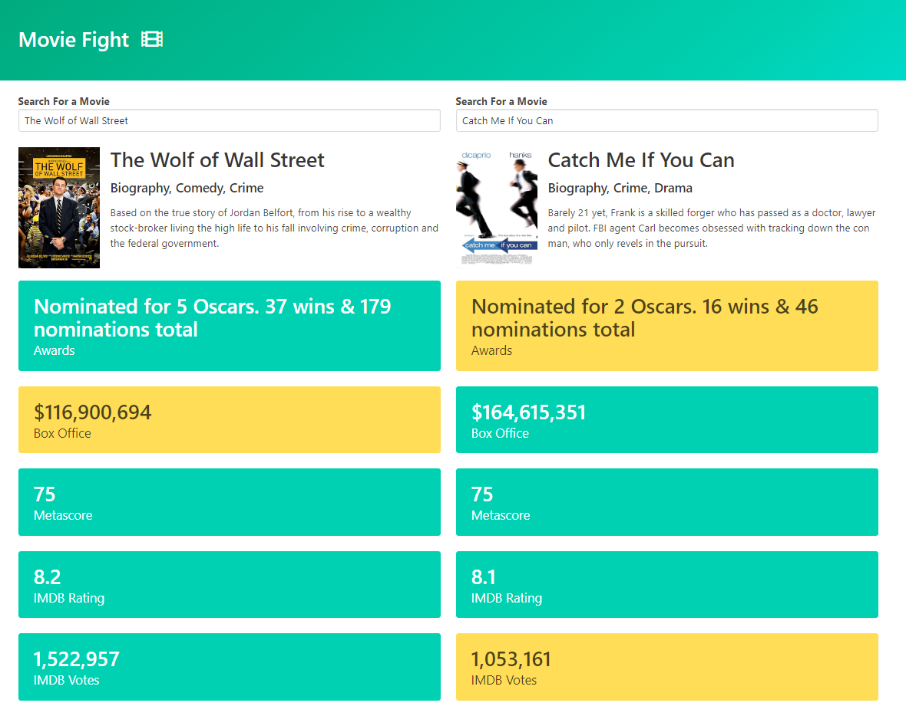

# movie-fight

## A movie comparison applicaton where users can
- Search For Two Movies.
- Autocomplete functionality for the users, so that they don't have to remember the exact name of the movie they are searching for.
- User will get the results of the two movies compared stat by stat.

## Technologies Used
1. HTML5
2. CSS and Bulma For Styling
3. Javascript

## API Used
- OMDB API

## Screenshots

